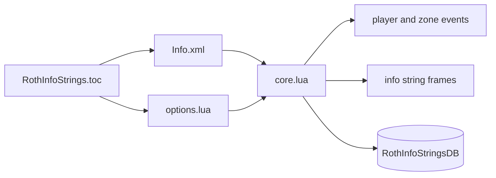

# RothInfoStrings code graph

```mermaid
flowchart LR
  T["RothInfoStrings.toc"] --> X["Info.xml"]
  T --> O["options.lua"]
  X --> C["core.lua"]
  C --> E["player and zone events"]
  C --> F["info string frames"]
  C --> DB[("RothInfoStringsDB")]
  O --> C
```
