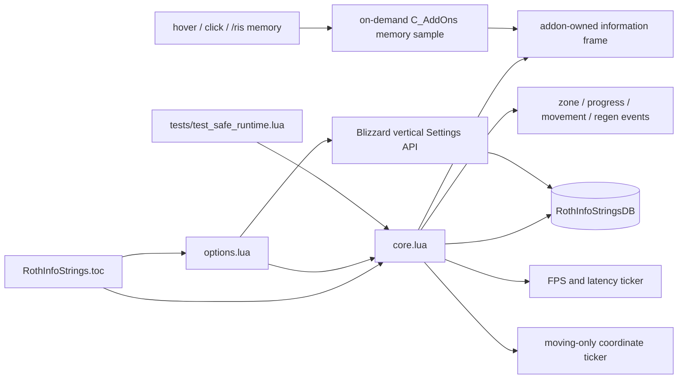

# RothInfoStrings code graph

```mermaid
flowchart LR
  T["RothInfoStrings.toc"] --> C["core.lua"]
  T --> O["options.lua"]
  C --> DB[("RothInfoStringsDB")]
  C --> E["zone / progress / movement / regen events"]
  C --> F["addon-owned information frame"]
  C --> P["FPS and latency ticker"]
  C --> Q["moving-only coordinate ticker"]
  H["hover / click / /ris memory"] --> M["on-demand C_AddOns memory sample"]
  M --> F
  O --> S["Blizzard vertical Settings API"]
  S --> DB
  O --> C
  X["tests/test_safe_runtime.lua"] --> C
```

No periodic memory scan or external addon integration exists in the current runtime.
